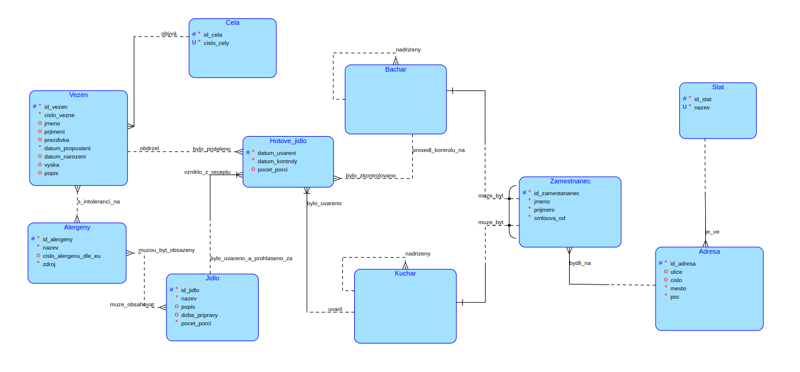
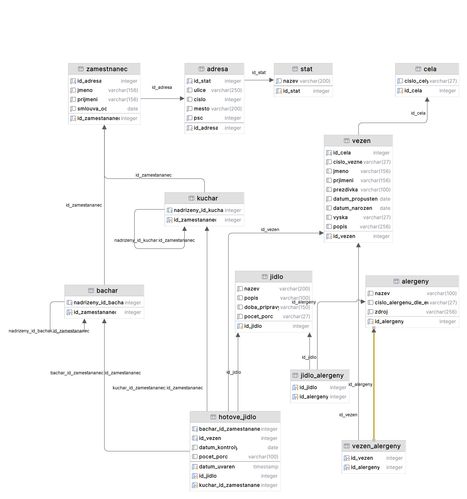
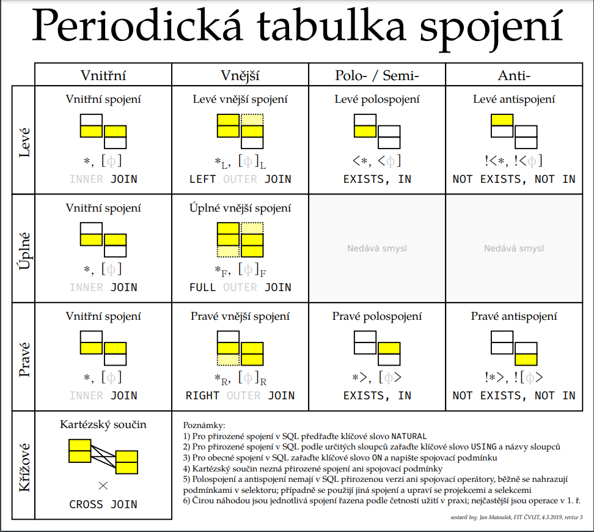

# Surviving Regulars of the System / Přeživší štamgasti systému

## Semester Project Overview
This README is dedicated to the semester project "Surviving Regulars of the System" (Přeživší štamgasti systému). This project centers around a database that captures the intricate workings of a prison located in the Dejvice district of Prague, nicknamed "štamgasti." The database is designed to handle information about prisoners, meals, employees, and more, ensuring efficient management and operational oversight.

### Database Description
The database meticulously records information about the prison and its operations:

- **Vězeň** (prisoner): Each prisoner is tracked with attributes such as *jméno* (first name), *příjmení* (last name), *datum narození* (date of birth), *datum propuštění* (release date), *výška* (height), and *vězeňské číslo* (prisoner ID).
- **Cely** (cells): Cells are identified by a *unikátní číslo* (unique number) and can house two prisoners, each with their own bed.
- **Jídlo** (meals): Meals have attributes like *název* (name) and *datum uvaření* (preparation date). Each meal is prepared by a single **kuchař** (cook).
- **Alergeny** (allergens): Allergens are tracked for prisoners with intolerances, including their *název* (name), *zdroje* (sources), and *číslo alergenu dle EU* (EU allergen number).
- **Zaměstnanci** (employees): This includes **bachaři** (guards) and **kuchaři** (cooks), recorded with attributes like *jméno* (first name), *příjmení* (last name), **adresa** (address: *ulice* (street), *číslo* (number), *město* (city), and *psc* (postal code)), **stát** (state: *název* (name)), and *datum nástupu* (hire date).
- **Kontrola_jídla** (meal inspection): Guards inspect meals before they are delivered to prisoners, with details recorded such as *jméno bachaře* (guard's name) and *datum kontroly* (inspection date).

Other entities include **hotové_jídlo** (prepared meals), **stat** (state), **adresa** (address), and relationships between guards and cooks involving supervisory roles.

### Conceptual Schema

## Loop Discussion
The database design includes several loops, each discussed below for potential risks and their resolutions:

1. **Smyčka vězeň-alergeny-jídlo-hotové_jídlo-vězeň** (Loop prisoner-allergens-meal-prepared_meal-prisoner):
   - This loop is safe and does not pose a risk to data integrity, as allergens independently store data about prisoners and meals.

2. **Smyčka jídlo-hotové_jídlo-bachař-zaměstnanec-kuchař-jídlo** (Loop meal-prepared_meal-guard-employee-cook-meal):
   - A potential issue could arise if one employee could be both a guard and a cook. However, this is avoided using specialization, ensuring employees are either guards or cooks, not both.

3. **Smyčka bachař-bachař** (Loop guard-guard):
   - This supervisory relationship could cause:
     a) An employee supervising themselves – this is prevented.
     b) Circular supervision – also prevented.

4. **Smyčka kuchař-kuchař** (Loop cook-cook):
   - Similar issues to the guard loop:
     a) A cook supervising themselves – prevented.
     b) Circular supervision – also prevented.

## SQL Scripts

### Create Script
The `create-script.sql` contains SQL statements to create the database schema. It ensures:
- Tables, attributes, and relationships are properly defined.
- Integrity constraints like primary and foreign keys are implemented.

[Link to Create Script Documentation](./create-script)

### Insert Script
The `insert-script.sql` populates the database with sample data, including employees, prisoners, meals, and allergens. It ensures:
- Data consistency and proper relationships.
- Transactions are correctly committed.

[Link to Insert Script Documentation](./insert-script)

## Queries
This section includes 31 predefined SQL queries for data retrieval and manipulation. Queries cover various use cases and categories, ensuring robust functionality.

For detailed descriptions and examples of each query, refer to the [Queries Documentation](./queries).

## Periodic Table of Joins

This graphic serves as a visual instrument to understand the relationships and structure of joins in a periodic table format. It simplifies complex SQL join operations by categorizing and presenting them in an easy-to-digest manner, helping users to intuitively grasp join types and their applications.

*Note: For a downloadable version of the periodic table in PDF format, refer to [Periodic Table of Joins](periodic-table-of-joins.pdf).*

